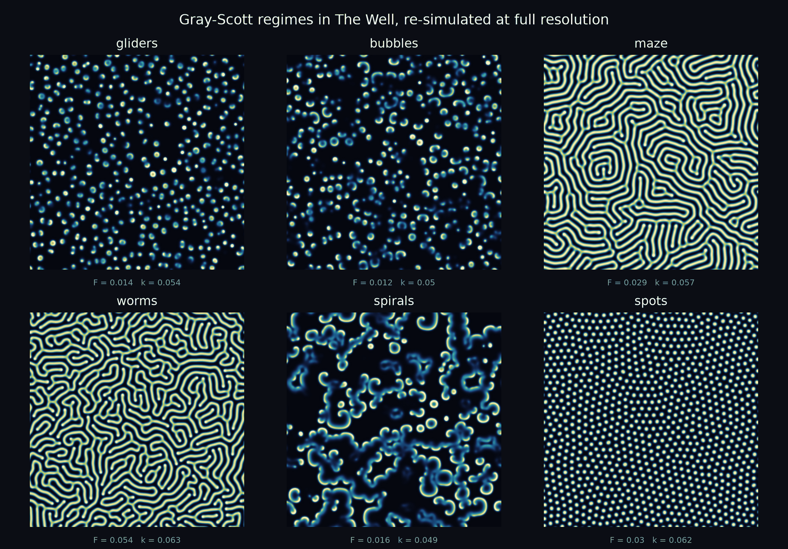

# litefno-extension

**SpecScope: what did the operator learn?** An extension of the
[LiteFNO reproduction](https://github.com/AIscend-Research/litefno-repro) that
treats a trained Fourier neural operator's spectral weights as an empirical
transfer function of the system rather than as opaque parameters, extracts their
pole structure with classical system identification, and asks two questions:
does that readout predict where the surrogate will fail (H1), and do the learned
factors transplant across regimes (H2)?

What makes the answers checkable is the choice of testbed. On an exactly
solvable oscillatory PDE the per-mode poles are known in closed form, so "what
the network should have learned" is not a matter of opinion. See
[docs/operator_poles.md](docs/operator_poles.md) for the extraction and its
ground-truth check, [docs/resonance_risk.md](docs/resonance_risk.md) for H1, and
[docs/mode_transplant.md](docs/mode_transplant.md) for H2.

A third question follows from the same testbed: if the surrogate's output is
used to *decide* something, what does its error cost? ext22 puts a fairness-aware
resource allocation layer on top of the reconstructed ecosystem state and finds
that the cost depends on which fairness rule sits downstream, in closed form --
sensitivity is U-shaped in the fairness parameter with an exact zero at the
envy-free point, so pure max-efficiency and pure max-min are both fragile and the
fair middle is not. See
[docs/fair_allocation.md](docs/fair_allocation.md) for H3.

ext23 reads that same layer as a mechanism, since the regions being allocated to
are often the ones reporting on themselves. The incentive to misreport turns out
to be the *same derivative* as the sensitivity to surrogate error, so
manipulation-robustness and error-robustness cannot be bought separately: the
only strategy-proof rule in the family is the envy-free one, and it is
strategy-proof because it ignores the state. A leximin implementation with
per-region capacities bounds what any lie can win without payments or
verification. See
[docs/strategic_allocation.md](docs/strategic_allocation.md) for H4.

ext24 drops the assumption both of those make — that regions are independent
once you know the field — and lets scarcity spread along a trade network with an
SIS cascade borrowed from epidemiology, with a graph-convolutional head on top of
LiteFNO. The framing comes from a closed form: on a periodic grid the Fourier
modes *are* the lattice Laplacian's eigenvectors (residual 1.5e-14), so a
spectral convolution is already a graph convolution and only non-lattice edges
can be new capacity. They are: the true network beats a same-degree wrong-wiring
control by 12-23% and beats the lattice graph by 0% at zero shortcuts rising to
27% at 78%. See
[docs/network_scarcity.md](docs/network_scarcity.md) for H5.

ext25 asks whether any of this is deployable on the hardware a low-resource
scientist has. It is the first extension whose answer is about the repository
itself: parameter count, the number a low-rank paper reports, has a rank
correlation of **0.067** with batch-1 latency across the model family — the
CP-factorized arm has 383x fewer parameters than dense FNO-S and runs 37%
slower, because CP rebuilds its dense spectral weight on every forward pass at a
cost that does not depend on batch size. Folding that reconstruction once at eval
time is worth 1.4-1.8x for bitwise-identical outputs and an unchanged checkpoint.
See [docs/deployability.md](docs/deployability.md) for H6.

The reproduction this builds on stands unchanged: on Gray-Scott at 32x32 across
three seeds, a parameter-matched low-rank CNN matches or outperforms LiteFNO on
one-step VRMSE and on autoregressive rollout, so there is no consistent evidence
for a Fourier inductive-bias advantage at that scale. See
[docs/reproducibility_findings.md](docs/reproducibility_findings.md).



The regimes above are re-simulated at 384x384 for legibility; training runs on
32x32 fields, where they are hard to tell apart by eye. See
[docs/visuals.md](docs/visuals.md) for how the renders and the method diagrams
are produced, and for what they are and are not evidence of.

## Repository layout

```
src/litefno/   Python package (models, training, metrics, data, preprocessing)
configs/       YAML configs: datasets/ and experiments/
scripts/       CLI helpers and Kaggle notebook builders (build_*_notebook.py)
notebooks/     Generated Kaggle notebooks (built by scripts/build_*.py)
results/       Numeric outputs: seeds/ mechinterp/ extensions/ logs/ checkpoints/
figures/       Plots: headline/ mechinterp/ extensions/ reproduction/,
               plus simulations/ (regime renders) and diagrams/ (method SVGs)
data/          Gray-Scott data (raw/ and processed/; not in git, see Zenodo)
tests/         pytest suite
docs/          Setup, reproduction guide, and reproducibility notes
```

`metadata.yaml` and `bibliography.bib` are submission metadata for the
accompanying write-up; they are not needed to run the code.

The authoritative seed-robust numbers are in `results/seeds/` (3-seed headline)
and `results/mechinterp/` (3-seed dead-mode, CP-rank, mode ablation), with
figures in `figures/headline/` and `figures/mechinterp/`. Checkpoints and data
are git-ignored and distributed via Zenodo.

## Install

```bash
conda create -n fno python=3.10
conda activate fno
pip install torch torchvision torchaudio --index-url https://download.pytorch.org/whl/cu121
pip install -e .          # add [dev] for the test dependencies
```

Dataset downloads use the official Polymathic `the_well` package, which provides
the `the-well-download` CLI:

```bash
pip install the_well
the-well-download --help   # verify it is on your PATH
```

The downloader pulls from HuggingFace; if a dataset is gated, run
`huggingface-cli login` once before `litefno download`.

## Fast path: data and checkpoints from Zenodo

Preprocessed Gray-Scott data and trained checkpoints (matched CNN plus 3-seed
CP-factorized spectral LiteFNO) are archived on Zenodo under CC BY 4.0:

**DOI: [10.5281/zenodo.20718092](https://doi.org/10.5281/zenodo.20718092)**

```bash
unzip litefno-repro-data.zip
cp -R litefno-repro-data/data/processed/* data/processed/
cp    litefno-repro-data/checkpoints/*.pt results/checkpoints/
```

That is enough to run the notebooks and `litefno test` without re-downloading
the 44 GB raw dataset from The Well.

## Slow path: build the data yourself

The project expects The Well datasets as HDF5 with shape
`(n_traj, n_steps, H, W, fields)`.

```bash
litefno download   --config configs/datasets/gray_scott_reaction_diffusion.yaml
litefno preprocess --config configs/datasets/gray_scott_reaction_diffusion.yaml
```

## Train and evaluate

```bash
litefno train --config configs/experiments/litefno_gray_scott_reaction_diffusion.yaml
```

Override any config value on the CLI:

```bash
litefno train --config configs/experiments/litefno_gray_scott_reaction_diffusion.yaml \
  --set training.epochs=10 --set training.device=cuda
```

Metrics are appended to the JSONL path in the config under
`logging.metrics_path`.

Evaluate a checkpoint on a split (`train`, `valid`, or `test`; default `test`).
Results are printed and appended to the metrics JSONL with `step: -1`:

```bash
litefno test \
  --config configs/experiments/litefno_gray_scott_reaction_diffusion.yaml \
  --checkpoint outputs/checkpoints/gray_scott_reaction_diffusion/litefno/best.pt
```

### Checkpoints

When `training.checkpoint_every > 0` or `training.checkpoint_best_metric` is
set, checkpoints go to `training.checkpoint_dir` (default
`outputs/checkpoints/<dataset>/<model>/`):

- `last.pt`: overwritten every `checkpoint_every` epochs
- `best.pt`: overwritten whenever `checkpoint_best_metric` (e.g. `valid_vrmse`)
  improves

Resume with `training.resume_from`, either in the config or via
`--set training.resume_from=<path>`.

### Run everything

```bash
scripts/run_all.sh                       # both models, all 8 datasets
scripts/run_all.sh --model litefno       # one model
scripts/run_all.sh --dataset gray_scott_reaction_diffusion
```

## Tests

```bash
python -m pytest
```

GitHub Actions runs the same command on pushes and pull requests via
[.github/workflows/tests.yml](.github/workflows/tests.yml).

## Documentation

- [Project overview](docs/overview.md) and [TL;DR](docs/tldr.md)
- [Setup](docs/setup.md)
- [Data and preprocessing](docs/data.md)
- [Training and evaluation](docs/training.md)
- [Reproduction guide](docs/reproduction.md)
- [Experiments](docs/experiments.md)
- [Configuration reference](docs/configs.md)
- [Metrics](docs/metrics.md)
- [Reproducibility findings](docs/reproducibility_findings.md)
- [Deviations from the paper](docs/notes_deviations.md)
- [Extensions roadmap](docs/extensions.md)

### SpecScope

- [Reading the poles out of a trained operator](docs/operator_poles.md) (ext19)
- [Does the pole readout predict failure?](docs/resonance_risk.md) (ext20, H1)
- [Do the resonant factors carry across regimes?](docs/mode_transplant.md) (ext21, H2)

```bash
python3 scripts/operator_poles.py     # extraction + closed-form check
python3 scripts/resonance_risk.py     # H1
python3 scripts/mode_transplant.py    # H2
```

Each takes `--quick` for a plumbing check. All three are self-contained: they
generate their own PDE testbeds, so they run without The Well data or a GPU.

### Downstream decisions

- [What does a surrogate's error cost a fair decision?](docs/fair_allocation.md)
  (ext22, H3)
- [Is the allocation robust to manipulation?](docs/strategic_allocation.md)
  (ext23, H4)
- [Does scarcity travel on a network the operator cannot see?](docs/network_scarcity.md)
  (ext24, H5)

```bash
python3 scripts/fair_allocation.py       # H3
python3 scripts/strategic_allocation.py  # H4
python3 scripts/network_scarcity.py      # H5
```

### Cost

- [Is the low-rank operator actually deployable?](docs/deployability.md)
  (ext25, H6)

```bash
python3 scripts/deployability.py         # H6
```

### Spectral characterisation of the data

- [Harmonic content by scenario](docs/harmonic_content.md)
- [Field recovery under thin sensor coverage](docs/data_sparsity.md)
- [Forced harmonics: is a temporal prior worth it?](docs/forced_harmonics.md)
- [In-distribution reference number for LiteFNO](docs/baseline_reference.md)
- [Visuals: regime renders and method diagrams](docs/visuals.md)
